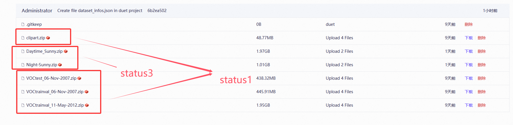
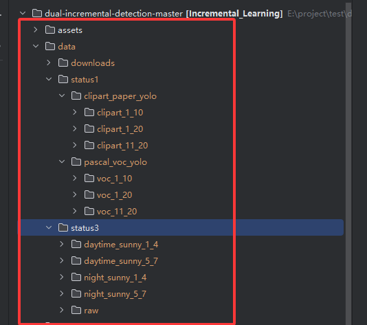
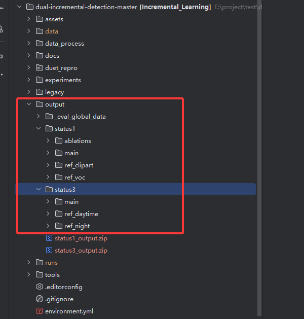

# DuET-CIOD 复现

> 论文：*Dual Incremental Object Detection via Exemplar-Free Task Arithmetic* (ICCV 2025)
>
> 本指南面向课程复现、测试和验收人员，用于从环境搭建、数据准备、模型训练到论文指标评估完整复现本项目。

## 一、技术路线说明

本项目复现的是 DuET 的核心思想：

```text
共享层：Backbone / Neck 使用 task vector 进行 DuET 融合
检测头：Detect head 作为任务特定模块，不参与共享层 task vector 融合
旧类保护：旧类分类行从上一阶段模型保留
新类学习：新类分类行来自当前阶段训练后的模型
损失函数：标准检测损失 + 蒸馏损失 + 方向一致性损失
```

关键配置：

```yaml
duet:
  enabled: true
  use_duet_module: true
  gamma: 0.1
  alpha_base: 0.5
  distill_weight: 0.01
  dc_weight: 0.01
  shared_key_exclude:
    - model.23
```

其中 `model.23` 是 YOLO11n 的 Detect head。排除它表示：

```text
Detect head 不参与 shared task vector 融合。
backbone/neck 参与 DuET Module 融合。
```

以两阶段任务为例：

```text
T1: 训练 10 类 head
T2: 扩展为 20 类累计 head
最终: 旧类行来自 T1，新类行来自 T2，backbone/neck 用 DuET 融合
```

---

## 二、交付文件清单

项目目录应包含以下主要内容：

```text
dual-incremental-detection-master/
├── README.md                         # 项目复现与验收说明
├── environment.yml                    # Conda 环境配置
├── requirements.txt                   # pip 依赖列表
├── yolo11n.pt                         # YOLO11n 预训练权重
├── data/                              # 数据集与预处理输出
├── data_process/
│   ├── prepare_data.py                # 数据预处理实际执行脚本
│   └── configs/                       # status1/status3 数据准备 YAML
├── duet_repro/
│   ├── core/                          # task vector、损失、指标等核心算法
│   ├── datasets/                      # YOLO 标签映射与累计标签数据生成
│   ├── engines/                       # 训练、评估、checkpoint、Ultralytics patch
│   ├── experiments/                   # 场景注册与配置路径解析
│   ├── modeling/                      # YOLO Detect head 辅助逻辑
│   └── utils/                         # 项目路径等公共工具
├── experiments/
│   ├── status1/                       # status1 主实验、参考模型、消融 YAML
│   └── status3/                       # status3 主实验、参考模型 YAML
├── legacy/
│   ├── status1/                       # status1 评估、消融脚本
│   └── status3/                       # status3 评估脚本
├── output/
│   ├── status1/                       # status1 模型、日志、metrics 输出
│   └── status3/                       # status3 模型、日志、metrics 输出
└── tools/                             # 推荐使用的统一命令行入口
```

**不随代码自动提供、需要自行准备的内容：**

- 各场景 YOLO 格式数据集。
- YOLO11n 预训练权重 `yolo11n.pt`。
- 如需直接评估，需准备已经训练好的 `output/status*/` 模型文件。

---

## 三、核心代码说明

| 文件 | 作用 |
| --- | --- |
| `tools/train.py` | 统一训练入口，按 `--scenario` 和 `--config` 调度对应 legacy 训练脚本 |
| `tools/evaluate.py` | 统一评估入口，读取 eval YAML 并计算 RI/GI/RAI |
| `tools/prepare_data.py` | 统一数据准备入口，读取 `data_process/configs/*.yaml` |
| `tools/run_ablation.py` | status1 消融实验入口，支持 `--name` 单个消融和 `--all` 全部消融 |
| `duet_repro/experiments/registry.py` | 注册当前可运行场景，解析 `experiments/status*/...yaml` 路径 |
| `duet_repro/engines/scenario_runner.py` | 将统一入口转发到 legacy 训练、评估、数据准备脚本 |
| `duet_repro/engines/duet_trainer.py` | DuET 训练流程中的模型初始化、任务训练和融合逻辑 |
| `duet_repro/engines/checkpoints.py` | checkpoint 路径归一化、manifest 与权重解析辅助 |
| `duet_repro/engines/ultralytics_patch.py` | 对 Ultralytics 训练流程进行项目所需 patch |
| `duet_repro/core/task_vectors.py` | 计算 task vector，并提供 state_dict 合并工具 |
| `duet_repro/core/losses.py` | 实现蒸馏损失、方向一致性损失等训练损失 |
| `duet_repro/core/metrics.py` | RI、GI、RAI 等指标辅助计算 |
| `duet_repro/datasets/remap.py` | 将局部类别标签映射到累计/全局类别空间 |
| `duet_repro/modeling/heads.py` | YOLO Detect head 扩展、拷贝和类别行处理辅助 |
| `legacy/status1/train_duet.py` | status1 实际训练脚本，由 `tools/train.py` 调度 |
| `legacy/status1/eval_paper_metrics.py` | status1 实际指标评估脚本，由 `tools/evaluate.py` 调度 |
| `legacy/status1/run_ablation.py` | status1 消融 YAML 生成和消融训练脚本 |
| `legacy/status3/train_duet.py` | status3 实际训练脚本，由 `tools/train.py` 调度 |
| `legacy/status3/eval_paper_metrics.py` | status3 实际指标评估脚本，由 `tools/evaluate.py` 调度 |

---

## 四、环境搭建 

环境安装更为麻烦，我们提供了两种方式配置环境：conda一键配置（时间较久）、自行下载单包

### 4.1 创建并激活 conda 环境

推荐使用项目复现环境：

```powershell
conda env create -f environment.yml
conda activate duet-repro
```

### 4.2 单独下载

手动逐个安装 environment.yml 依赖

```
1. 创建并进入 conda 环境
conda create -n duet-repro python=3.10 pip -y
conda activate duet-repro

2. 安装 PyTorch + CUDA 12.1
conda install pytorch torchvision pytorch-cuda=12.1 -c pytorch -c nvidia -y

3. 安装 conda 基础依赖
conda install numpy pyyaml tqdm pillow -c conda-forge -y

4. 安装 pip 依赖
pip install "ultralytics>=8.3.0"
pip install opencv-python pandas matplotlib rich

5. 验证 PyTorch / CUDA
python -c "import torch; print(torch.__version__); print(torch.cuda.is_available()); print(torch.version.cuda)"

6. 验证 Ultralytics
python -c "import ultralytics; print(ultralytics.__version__)"

可选：如果想固定到之前日志里的 Ultralytics 版本
pip install ultralytics==8.4.41
```

---

## 五、代码部署

### 5.1 预训练权重

已放好

### 5.2 训练好的权重

status1:[双增量数据库 · 数据集](https://www.modelscope.cn/datasets/libowen223/duet/tree/master/status1-pt)

status3:[双增量数据库 · 数据集](https://www.modelscope.cn/datasets/libowen223/duet/tree/master/status3-pt)

## 六、数据准备

所有数据集最终都整理为 YOLO 检测格式：

```text
dataset_root/
├── images/
│   ├── train/
│   └── val/
├── labels/
│   ├── train/
│   └── val/
└── data.yaml
```

标签格式为：

```text
class_id x_center y_center width height
```

### 6.1 数据集下载 、放置和预处理

数据集下载链接：[双增量数据库 · 数据集](https://www.modelscope.cn/datasets/libowen223/duet/tree/master/downloads)



默认配置下，场景1和场景3的 zip 放置位置如下：

```text
data/downloads/
```

放置好zip文件后，本项目提供统一的数据预处理入口。正常情况下，不需要修改 Python 代码，直接使用已经写好的 YAML 配置即可运行：

```powershell
python data_process/prepare_data.py --plan data_process/configs/status1.yaml
python data_process/prepare_data.py --plan data_process/configs/status3.yaml
```

如果后期要换 zip 名、换数据目录、换任务划分，只需要修改对应的 YAML 文件：

```text
data_process/configs/status1.yaml
data_process/configs/status3.yaml
```



### 6.2 数据处理 YAML 主要字段说明

`prepare_data.py` 会完全按照 `--plan` 指定的 YAML 执行。YAML 中主要字段含义如下：

| 字段 | 含义 |
| --- | --- |
| `kind` | 数据处理类型。`voc_clipart` 表示场景1的 VOC/Clipart 原始数据处理；`voc_zip_slices` 表示场景3的 VOC XML 格式 zip 切片处理。 |
| `zip_root` | 原始 zip 文件所在目录。脚本会从这里读取压缩包。 |
| `data_root` | 处理后数据集的输出根目录。场景1写入 `data/status1`，场景3写入 `data/status3`；场景3的解压缓存会放在 `data_root/raw` 下。 |
| `update_configs` | 预处理完成后，需要自动更新 `data:` 路径的训练/评估配置文件。 |
| `voc_zips` | 场景1使用，VOC 官方 zip 文件名列表。 |
| `clipart_zip` | 场景1使用，Clipart zip 文件名。 |
| `voc_tasks` | 场景1使用，定义要生成哪些 VOC 子任务数据集。 |
| `clipart_tasks` | 场景1使用，定义要生成哪些 Clipart 子任务数据集。 |
| `class_names` | 场景3使用，定义 VOC XML 中类别名到全局类别编号的顺序；当前为 `bike, bus, car, motor, person, rider, truck`，对齐论文表 S6。 |
| `daytime_sunny_zips` / `night_sunny_zips` | 场景3使用，定义 Daytime Sunny 和 Night Sunny 原始 zip 文件名。当前分别指向 `Daytime_Sunny.zip` 和 `Night-Sunny.zip`。 |
| `daytime_sunny_tasks` / `night_sunny_tasks` | 场景3使用，定义要从对应天气域里切出的任务数据集。 |
| `name` | 任务名称，同时也是默认输出目录名。训练配置中的任务名需要和它对应。 |
| `zip` | 当前任务读取的 zip 文件名，写在 `*_zips` 下面。 |
| `class_indices` | 当前任务对应的全局类别编号。增量训练时用它对齐最终检测头中的类别通道。 |
| `train_split` / `val_split` | 指定当前任务使用哪个 split 作为训练集和验证集。 |
| `train_splits` | 场景1 VOC 使用，表示多个 VOC split 合并为训练集。 |

例如场景3中的一个任务可以写成：

```yaml
night_sunny_zips:
  night_sunny_5_7:
    zip: Night-Sunny.zip

night_sunny_tasks:
  - name: night_sunny_5_7
    class_indices: [4, 5, 6]
    train_split: train
    val_split: test
```

这表示脚本会从 `zip_root` 下读取 `Night-Sunny.zip`，生成 `night_sunny_5_7` 数据集，并只保留全局类别 `[4, 5, 6]`，也就是论文中的 `person, rider, truck`。

## 七、路径修改

本项目的路径主要在各场景 `configs/*.yaml` 中修改。

### 7.1 数据路径

例如：

```yaml
tasks:
  - name: daytime_sunny_1_4
    data: /your/path/to/daytime_sunny_1_4/data.yaml
    class_indices: [0, 1, 2, 3]
    labels_are_global: false
```

如果数据标签是局部编号，例如当前任务只有 3 类，标签为 `0,1,2`，则写：

```yaml
labels_are_global: false
```

代码会根据 `class_indices` 自动把局部标签映射到累计 head 的通道位置。

### 7.2 输出路径

主实验输出目录统一在：

```text
output/status1/main
output/status2/main
output/status3/main
```

参考模型输出目录：

```text
output/status1/ref_*
output/status2/ref_*
output/status3/ref_*
```

### 7.3 GPU 设备

配置文件中：

```yaml
training:
  device: 0
```

如果服务器只暴露一张卡，或者使用了：

```bash
CUDA_VISIBLE_DEVICES=1
```

程序内部通常仍应写：

```yaml
device: 0
```

否则容易出现：

```text
CUDA error: invalid device ordinal
```

---

## 八、训练全流程

### 8.1 场景1主实验

论文对应地址和训练流程：

```text
主文 Table 2：VOC[1:10] -> Clipart[11:20] 两阶段 DuIOD 结果
补充材料 Table S7：VOC[1:10] -> Clipart[11:20] 不同 base detector 的详细结果

主实验：VOC[1:10] 训练 T1 -> Clipart[11:20] 训练 T2 -> DuET 融合共享层 -> 输出最终 T2 模型
T2-only：复用已经存在的 T1 checkpoint，跳过 T1，只训练 Clipart[11:20]
参考模型：单独训练 VOC[11:20] 和 Clipart[1:10]，只用于计算 Avg GI 分母
```

完整训练：

```powershell
python tools\train.py --scenario status1 --config experiments\status1\train.yaml
```

如果已经训练好 T1，只从 T2 开始：

```powershell
python tools\train.py --scenario status1 --config experiments\status1\train_t2_only.yaml
```

训练 GI 分母参考模型：

```powershell
python tools\train.py --scenario status1 --config experiments\status1\ref_voc.yaml
python tools\train.py --scenario status1 --config experiments\status1\ref_clipart.yaml
```

主要输出：

```text
output/status1/main/task_1_voc_1_10_best.pt
output/status1/main/task_2_clipart_11_20_duet.pt

output/status1/ref_clipart/task_1_clipart_1_10_best.pt
output/status1/ref_voc/task_1_voc_11_20_best.pt
```

### 8.2 场景3主实验

对应论文表格 和 训练流程：

```text
主文 Table 1：Daytime Sunny[1:4] -> Night Sunny[5:7] 详细结果
主文 Table 3：DuET 在该场景下不同 base detector 的汇总结果
补充材料 Table S9：Daytime Sunny[1:4] -> Night Sunny[5:7] 不同 base detector 的详细结果

主实验：Daytime Sunny[1:4] 训练 T1 -> Night Sunny[5:7] 训练 T2 -> DuET 融合共享层 -> 输出最终 T2 模型
T2-only：复用已经存在的 Daytime Sunny[1:4] checkpoint，跳过 T1，只训练 Night Sunny[5:7]
参考模型：单独训练 Daytime Sunny[5:7] 和 Night Sunny[1:4]，只用于计算 Avg GI 分母
```

完整训练：

```powershell
python tools\train.py --scenario status3 --config experiments\status3\train.yaml
```

如果已经训练好 T1，只从 T2 开始：

```powershell
python tools\train.py --scenario status3 --config experiments\status3\train_t2_only.yaml --output-dir output/status3/main
```

训练 GI 分母参考模型：

```powershell
python tools\train.py --scenario status3 --config experiments\status3\ref_daytime.yaml
python tools\train.py --scenario status3 --config experiments\status3\ref_night.yaml
```

主要输出：

```text
output/status3/main/task_1_daytime_sunny_1_4_best.pt
output/status3/main/task_2_night_sunny_5_7_duet.pt

output/status3/ref_daytime/task_1_daytime_sunny_5_7_best.pt
output/status3/ref_night/task_1_night_sunny_1_4_best.pt
```

---

## 九、消融实验

对应论文表格   和  实验流程：

```text
主文 Table 4：YOLO11n 上 DuET 不同组件和损失项的消融实验

消融实验位于 `status1`，只针对场景1：VOC[1:10] -> Clipart[11:20]
```

消融组件包括：

```text
Seq FT
Incremental Head
DuET Module
L_Distill
L_DC
```

生成所有消融配置：

```powershell
python tools\run_ablation.py --scenario status1 --all --materialize-only
```

运行完整方法：

```powershell
python tools\run_ablation.py --scenario status1 --name 05_full
python tools\evaluate.py --scenario status1 --config experiments\status1\ablations\05_full_eval.yaml
```

单独运行每组消融：

```powershell
python tools\run_ablation.py --scenario status1 --name 00_no_seqft
python tools\run_ablation.py --scenario status1 --name 01_seqft
python tools\run_ablation.py --scenario status1 --name 02_seqft_incremental_head
python tools\run_ablation.py --scenario status1 --name 03_seqft_incremental_head_duet
python tools\run_ablation.py --scenario status1 --name 04_seqft_incremental_head_duet_distill
python tools\run_ablation.py --scenario status1 --name 05_full
```

评估对应消融：

```powershell
python tools\evaluate.py --scenario status1 --config experiments\status1\ablations\00_no_seqft_eval.yaml
python tools\evaluate.py --scenario status1 --config experiments\status1\ablations\01_seqft_eval.yaml
python tools\evaluate.py --scenario status1 --config experiments\status1\ablations\02_seqft_incremental_head_eval.yaml
python tools\evaluate.py --scenario status1 --config experiments\status1\ablations\03_seqft_incremental_head_duet_eval.yaml
python tools\evaluate.py --scenario status1 --config experiments\status1\ablations\04_seqft_incremental_head_duet_distill_eval.yaml
python tools\evaluate.py --scenario status1 --config experiments\status1\ablations\05_full_eval.yaml
```

---

## 十、评估全流程

### 10.1 场景1评估

```powershell
python tools\evaluate.py --scenario status1 --config experiments\status1\eval.yaml
```

### 10.2 场景3评估

```powershell
python tools\evaluate.py --scenario status3 --config experiments\status3\eval.yaml
```

评估输出：

```text
metrics.json
rai_metrics.json
```

指标含义：

```text
Avg RI = 旧任务保持能力
Avg GI = 未见切片泛化能力
RAI    = (Avg RI + Avg GI) / 2
```

---

## 十一、提供给测试小组的执行命令

配置好环境依赖、数据集处理好后，本节给测试小组直接照抄执行。默认测试人员已经进入项目根目录：

```powershell
cd E:\project\test\dual-incremental-detection-master\dual-incremental-detection-master
```

如果测试环境的 conda 环境名不同，请先切换到已经安装 `torch`、`ultralytics`、`yaml` 等依赖的环境。

### 11.1 重跑训练

  跟随步骤八、九、十即可

### 11.2 快速验收：只复算已有模型指标

下载我们训练好的权重，并放置在根目录下的output目录中，**命名规范严格按照我们的来**
status1:[双增量数据库 · 数据集](https://www.modelscope.cn/datasets/libowen223/duet/tree/master/status1-pt)

status3:[双增量数据库 · 数据集](https://www.modelscope.cn/datasets/libowen223/duet/tree/master/status3-pt)



放置后，可以跳过训练，直接执行评估命令：

```powershell
主训练评估
python tools\evaluate.py --scenario status1 --config experiments\status1\eval.yaml
python tools\evaluate.py --scenario status3 --config experiments\status3\eval.yaml


消融实验评估
python tools\evaluate.py --scenario status1 --config experiments\status1\ablations\01_seqft_eval.yaml
python tools\evaluate.py --scenario status1 --config experiments\status1\ablations\02_seqft_incremental_head_eval.yaml
python tools\evaluate.py --scenario status1 --config experiments\status1\ablations\03_seqft_incremental_head_duet_eval.yaml
python tools\evaluate.py --scenario status1 --config experiments\status1\ablations\04_seqft_incremental_head_duet_distill_eval.yaml
python tools\evaluate.py --scenario status1 --config experiments\status1\ablations\05_full_eval.yaml
```

评估完成后检查以下文件是否生成或更新：

```text
output/status1/main/metrics.json
output/status1/main/rai_metrics.json
output/status3/main/metrics.json
output/status3/main/rai_metrics.json
```

验收时主要看 `metrics.json` 中的三个字段：

```text
avg_ri_percent
avg_gi_percent
rai_percent
```

---

## 十二、输出文件说明

一次完整训练结束后，主输出目录通常包含：

```text
reference_full_head.pt
resolved_config.yaml
training_history.json
eval_manifest.json
task_*_best.pt
task_*_duet.pt
logs/train_*.txt
runs/<task_name>/weights/best.pt
```

其中：

| 文件 | 作用 |
| --- | --- |
| `reference_full_head.pt` | task vector 的 reference 模型 |
| `task_1_*_best.pt` | T1 训练完成模型 |
| `task_*_duet.pt` | 增量阶段 DuET 融合后的最终模型 |
| `training_history.json` | 每个任务的训练、初始化、合并记录 |
| `eval_manifest.json` | 评估脚本解析 checkpoint 的依据 |
| `metrics.json` | 详细 RI/GI/RAI 指标 |
| `rai_metrics.json` | 简化版论文指标 |

如果 `eval_manifest.json` 出现：

```json
"latest_checkpoint": null,
"history": []
```

说明该输出目录不是完整训练结果，通常是训练中断或新旧实验文件混在一起。

---

## 十三、关键注意事项 

1. **不要混用输出目录。**  
   每次完整实验建议使用干净的 `output/status*/main`，否则 `eval_manifest.json` 可能指向旧模型。

2. **T2-only 训练要确认输出目录。**  
   如果希望续跑结果仍写入主目录，应使用：

   ```powershell
   python tools\train.py --scenario status3 --config experiments\status3\train_t2_only.yaml --output-dir output/status3/main
   ```

3. **确认 `class_indices` 与标签空间一致。**  
   局部标签使用 `labels_are_global: false`；全局标签使用 `labels_are_global: true`。

4. **确认 GPU 编号。**  
   单卡环境一般写 `device: 0`。

5. **评估必须看 `eval_manifest.json`。**  
   `checkpoint: final` 实际会解析到 manifest 中的 `latest_checkpoint`。

6. **GI 分母模型必须单独训练。**  
   `ref_*` 模型只用于计算 Avg GI denominator，不参与主训练。

---

## 十四、实验结果记录

### 14.1 主实验汇总（主要指标）

| 实验 | 训练顺序 | 对应论文表 | Avg RI (%) | Avg GI (%) | RAI (%) |
| --- | --- | ---: | ---: | ---: | ---: |
| status1 | VOC[1:10] -> Clipart[11:20] | 论文正文：Table 3  Yolo11n   **or**   论文附录：Table S8. Yolo11n | 86.88 | 44.33 | 65.61 |
| status3 | Daytime Sunny[1:4] -> Night Sunny[5:7] | 论文正文：Table 2  Yolo11n   **or**   论文附录：Table S10. Yolo11n | 80.15 | 38.15 | 59.15 |

### 14.2 status1 过程性指标

| 指标 | 对应表格 | 分子 mAP50 | 分母 mAP50 | 比例 (%) |
| --- | ---: | ---: | ---: | ---: |
| RI_VOC_1_10 | 论文附录：Table S8. Yolo11n | 0.7200（old voc1_10） | 0.8288 | 86.88 |
| GI_VOC_11_20 | 论文附录：Table S8. Yolo11n | 0.1415 | 0.7968 | 17.76 |
| GI_Clipart_1_10 | 论文附录：Table S8. Yolo11n | 0.2795 | 0.3942 | 70.91 |

### 14.3 status3 过程性指标

| 指标 | 对应表格 | 分子 mAP50 | 分母 mAP50 | 比例 (%) |
| --- | ---: | ---: | ---: | ---: |
| RI_DaytimeSunny_1_4_after_T2 | 论文附录：Table S10. Yolo11n | 0.3731（old daytime_s1_4） | 0.4655 | 80.15 |
| GI_DaytimeSunny_5_7_at_T2 | 论文附录：Table S10. Yolo11n | 0.0798 | 0.5150 | 15.49 |
| GI_NightSunny_1_4_at_T2 | 论文附录：Table s10. Yolo11n | 0.2802 | 0.4608 | 60.80 |

### 14.4 消融实验记录

当前工作区中 `01_seqft` 到 `05_full` 均已有 `metrics.json`；`00_no_seqft` 目录存在，但未发现对应评估指标文件，因此暂记为未评估。**论文正文：对应表格 Table 4**

| 消融组 | 组件设置 | Avg RI (%) | Avg GI (%) | RAI (%) |
| --- | --- | ---: | ---: | ---: |
| 01_seqft | Seq FT only | 0.12 | 13.22 | 6.67 |
| 02_seqft_incremental_head | Seq FT + Incremental Head | 21.02 | 22.68 | 21.85 |
| 03_seqft_incremental_head_duet | Seq FT + Incremental Head + DuET Module | 69.34 | 29.83 | 49.58 |
| 04_seqft_incremental_head_duet_distill | Seq FT + Incremental Head + DuET Module + L_Distill | 88.62 | 41.69 | 65.15 |
| 05_full | Seq FT + Incremental Head + DuET Module + L_Distill + L_DC | 89.23 | 43.38 | 66.31 |

---

## Reference

DuET: *Dual Incremental Object Detection via Exemplar-Free Task Arithmetic*, ICCV 2025.

Ultralytics YOLO: https://github.com/ultralytics/ultralytics
